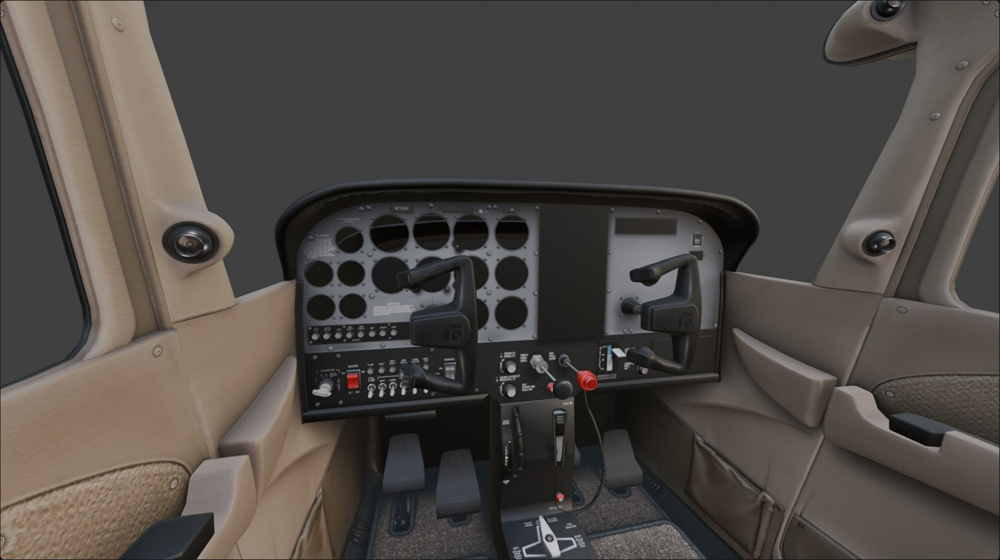
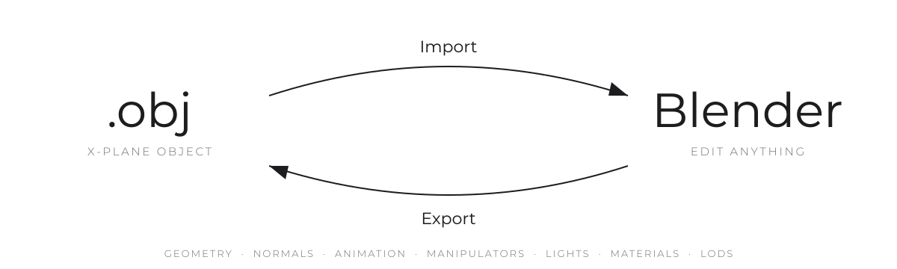
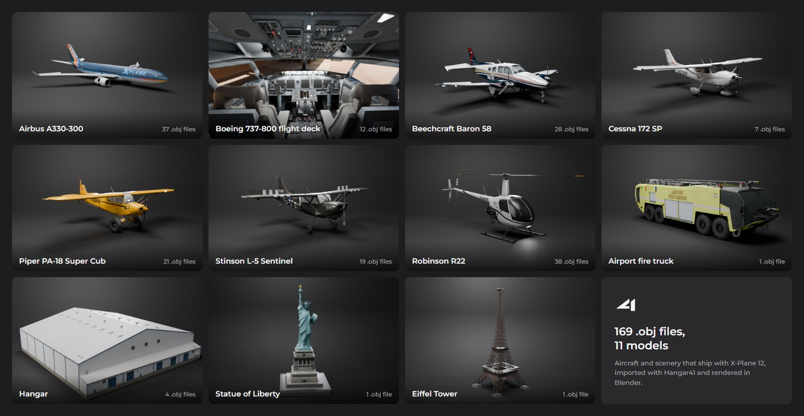
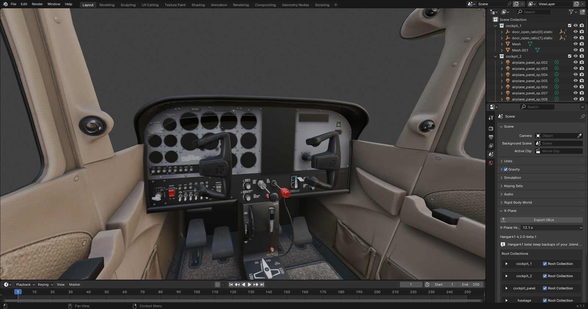

  <picture>
    <source media="(prefers-color-scheme: dark)" srcset="docs/brand/hangar41-logo-dark.svg">
    
  </picture>

  <b>Take any X-Plane .obj into Blender, and back out again.</b> 
  Animations, manipulators, lights and materials make the round trip intact.

  <a href="#install">Install</a>&nbsp;&nbsp;·&nbsp;&nbsp;<a href="#use">Use</a>&nbsp;&nbsp;·&nbsp;&nbsp;<a href="#what-makes-the-trip">What makes the trip</a>&nbsp;&nbsp;·&nbsp;&nbsp;<a href="#good-to-know">Good to know</a>&nbsp;&nbsp;·&nbsp;&nbsp;<a href="#limitations">Limitations</a>

 

  
   
  Laminar Research's Cessna 172, as it ships with X-Plane 12, imported with Hangar41. Instruments are separate objects in X-Plane, so their faces aren't part of this import.

 

Importers for X-Plane objects have existed for years. They bring geometry and some keyframes into Blender, but what comes out the other side rarely exports cleanly. Hangar41 is built around the whole trip: import a cockpit, change what you need, and export an object that still has every animation, click spot and light it started with.

 

  <picture>
    <source media="(prefers-color-scheme: dark)" srcset="docs/images/round-trip-dark.svg">
    
  </picture>

## What makes the trip

<table>
  <tr><td><b>Geometry</b></td><td>Every drawable triangle, with the object's own normals, UVs and double-sided faces.</td></tr>
  <tr><td><b>Animation</b></td><td>Translations, rotations, show/hide and keyframe loops, including nested pivots. Each part lands exactly where X-Plane puts it.</td></tr>
  <tr><td><b>Manipulators</b></td><td>Every type, including detents for flap handles, speedbrakes and gear levers.</td></tr>
  <tr><td><b>Lights, magnets, particles</b></td><td>Named, parameter, custom billboard and custom spill lights. EFB and flashlight magnets. Particle emitters and their <code>.pss</code>.</td></tr>
  <tr><td><b>Materials</b></td><td>Light levels, cockpit panels and regions, blending, shadows, hard surfaces, shininess.</td></tr>
  <tr><td><b>Structure</b></td><td>LOD buckets, textures (with X-Plane's <code>.png</code> to <code>.dds</code> fallback), cockpit and aircraft settings.</td></tr>
</table>

In Blender, imports are textured in the viewport and named after what they do: `yoke_roll_ratio` and `servos_toggle`, not `Mesh.412`.

## Tested on thousands of real objects

Every aircraft object in a well-stocked X-Plane 11 and 12 install, plus scenery chosen to cover every OBJ command, by many different authors: 6,648 files imported without a crash. 3,706 of them were imported, exported and re-imported, with each part checked against an independent reading of the original `.obj`.

<table align="center">
  <tr>
    <td align="center"><h3>168,369</h3>parts, each within 2&nbsp;mm of where X-Plane puts it</td>
    <td align="center"><h3>100M</h3>triangles round-tripped</td>
    <td align="center"><h3>33,842</h3>manipulators kept, all of them</td>
    <td align="center"><h3>24,800+</h3>lights and magnets kept</td>
  </tr>
</table>

Every one of those files with something to export exported. The few that didn't were empty placeholders, or held only old-style `LIGHTS`.

Whole aircraft, helicopters and scenery all import:

  

## Install

Hangar41 needs **Blender 4.1** and reads objects from **X-Plane 11 and 12**.

1. **Disable XPlane2Blender** if you have it. Hangar41 is built on it and shares its add-on name and settings, so only one can be enabled at a time.
2. Download the latest `Hangar41-….zip` from [**Releases**](https://github.com/dralexander0805/Hangar41/releases). There's no need to unzip it.
3. In Blender, open **Edit → Preferences → Add-ons → Install**, pick the zip, and enable
   **Import-Export: Hangar41: X-Plane .obj Import/Export**.

## Use

**Import.** Choose **File → Import → X-Plane Object (.obj)**. Each file becomes its own collection, already set up for export: export type, textures, cockpit regions and LODs all come from the `.obj`.

**Edit.** Work as you normally would in Blender. Animated parts are empties named after their datarefs, and manipulators live in each object's X-Plane properties.

**Export.** In **Scene Properties → X-Plane**, click **Export OBJs**. Save to a folder on the same drive as the textures, since X-Plane needs texture paths relative to the `.obj`.

**AviTab.** To give a cockpit an [AviTab](https://github.com/fpw/avitab) tablet, put the 3D cursor where the screen goes and choose **Add → Mesh → AviTab Screen**. Enter your panel texture's size and the rectangle of it AviTab should draw in; the screen comes out at the right proportions, mapped to that rectangle and lit by AviTab's brightness. A tablet body is added around it in its own collection, so it exports as its own `.obj` to add in Plane Maker. Then **File → Export → AviTab.json** writes the file that goes next to your `.acf`.

  

## Good to know

Hangar41 is in beta. Keep backups of your `.blend` files.

**If something wasn't imported, you're told.** After each import, the Info bar lists anything that won't make it into an export; the full log is in Blender's Text Editor as *Import for …*.

**Some things are written differently but mean the same to X-Plane.** A header `GLOBAL_specular` becomes per-material `ATTR_shiny_rat`, static `ANIM_rotate` and `ANIM_trans` are baked into the geometry, and state on invisible click zones is left out. Coordinates are rounded, so an exported part can sit up to about half a millimetre from the original.

**Files that bend the OBJ rules still come through.** Shipped aircraft and scenery do plenty the spec doesn't allow: numbers run together, lights `lights.txt` doesn't know, LOD buckets out of order. Hangar41 reads them the way X-Plane does and exports them as they were, with a warning.

## Limitations

**Tested on Blender 4.1 only.**

**Not imported yet** (each import warns, and they're missing from an export):

- old-style `LIGHTS` and `VLIGHT` lights, and `LINES`/`VLINE`
- `IF`/`ELSE`/`ENDIF` conditional blocks: what's inside is imported as if the condition were always true
- attributes from before X-Plane 10: `ATTR_cull`, `ATTR_no_cull`, `ATTR_diffuse_rgb`, `ATTR_emission_rgb`, `ATTR_shade_smooth`, `ATTR_depth`, and `smoke_black`/`smoke_white`
- `ATTR_layer_group` once the geometry has started (the one a file opens with is kept), and `DECAL_LIB` or `WEATHER_TRANSPARENT` among the geometry
- detent ranges on a drag manipulator whose `ATTR_axis_detented` has a zero axis, and `ATTR_axis_detent_range 0 0 0` on a plain drag-rotate handle (the manipulators themselves are kept)

**Left out on purpose**, because X-Plane doesn't draw them either: degenerate triangles, and whatever sits in an `ATTR_LOD` whose far isn't beyond its near.

**Changed on the way through:** geometry before the first `ATTR_LOD` goes in the first bucket, a `TEXTURE_DRAPED_NORMAL` scale is written as 1.0, and `BLEND_GLASS` on a scenery object is dropped.

**Some manipulators keep their `.obj` values.** A drag-rotate or detent handle whose animation doesn't fit the exporter's rules (a trim wheel with no animation, say) is exported from the numbers in its original `.obj`. Change its animation in Blender and the click zone won't follow; set the manipulator up by hand if you do.

**The export type is a guess.** An import becomes a Cockpit if it has manipulators or cockpit settings, Scenery if it has draped geometry, and Aircraft otherwise. Instanced scenery isn't detected; set it in the collection's X-Plane settings.

**Textures must be on the same drive as the export folder**, since X-Plane needs texture paths relative to the `.obj`.

**"Light name is unknown" on export** comes from the bundled `lights.txt`, which predates X-Plane 12. The lights are still written exactly as they were imported.

## Reporting bugs

The most useful report is an issue with the `.obj` attached, plus the *Import for …* text from Blender's Text Editor.

## Credits

Hangar41 builds on [**XPlane2Blender**](https://github.com/X-Plane/XPlane2Blender), Laminar Research's official exporter. Laminar's experimental importer (4.2 alpha) and Ted Greene's writing on why round-trip import is hard shaped the approach here. If a project belongs on this list, open an issue.

The wordmark's lettering is [Montserrat](https://github.com/JulietaUla/Montserrat) (SIL Open Font License), converted to outlines.

## License

[GPL-3.0](LICENSE)
